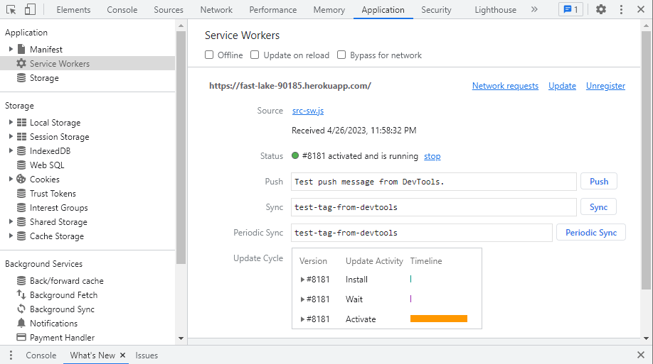

# 4-20-23-NoSQL-Social-Network-API

## Description

#### Building a browser-friendly text editor using Progressive Web Applications and IndexedDB 
---

## Contents
- [User Story](#user-story)
- [Installation](#installation)
- [Media](#media)
- [Credits](#credits)
- [Technology Used](#technology-used)
- [License](#license)
​
### User Story
```md
AS A developer
I WANT to create notes or code snippets with or without an internet connection
SO THAT I can reliably retrieve them for later use
```
## Installation:

Utilizing the Application is simple!

Option A - Use the Heroku Deployment directly by way of https://fast-lake-90185.herokuapp.com/.

Option B - Clone the repo:
    
    git clone git@github.com:jmabie94/4-27-23-PWA-Text-Editor.git

Next, open an integrated terminal in your cloned folder and do the following:
    
    run "npm init -y"
    run "npm i"

After Node Packages have installed, open run the application:

    run "npm run start"


Finally, open your browser to http://localhost:3000/ and freely edit the text or install the application!
​
## Media

### J.A.T.E. in Browser View:


### J.A.T.E. Manifest:


### J.A.T.E. Service Worker:


### J.A.T.E. IndexedDB:

​
## Credits
- Jack Mabie (https://github.com/jmabie94)
​
## Technology Used
    - Javascript
    - IndexedDB
    - Express.js
    - Webpack PWAs
    - Service Workers
    - Tutoring
    
## License
​
[](https://opensource.org/licenses/MIT)
​
MIT License
Copyright (c) [2023] [The Five Loopers]
Permission is hereby granted, free of charge, to any person obtaining a copy
of this software and associated documentation files (the "Software"), to deal
in the Software without restriction, including without limitation the rights
to use, copy, modify, merge, publish, distribute, sublicense, and/or sell
copies of the Software, and to permit persons to whom the Software is
furnished to do so, subject to the following conditions:
The above copyright notice and this permission notice shall be included in all
copies or substantial portions of the Software.
THE SOFTWARE IS PROVIDED "AS IS", WITHOUT WARRANTY OF ANY KIND, EXPRESS OR
IMPLIED, INCLUDING BUT NOT LIMITED TO THE WARRANTIES OF MERCHANTABILITY,
FITNESS FOR A PARTICULAR PURPOSE AND NONINFRINGEMENT. IN NO EVENT SHALL THE
AUTHORS OR COPYRIGHT HOLDERS BE LIABLE FOR ANY CLAIM, DAMAGES OR OTHER
LIABILITY, WHETHER IN AN ACTION OF CONTRACT, TORT OR OTHERWISE, ARISING FROM,
OUT OF OR IN CONNECTION WITH THE SOFTWARE OR THE USE OR OTHER DEALINGS IN THE
SOFTWARE.
​
---